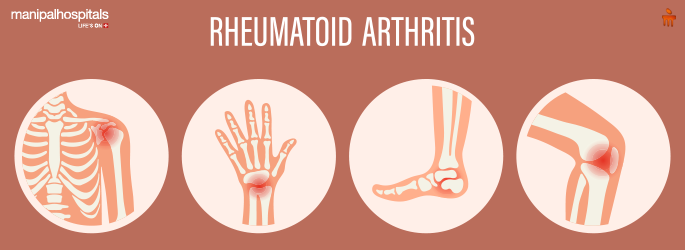
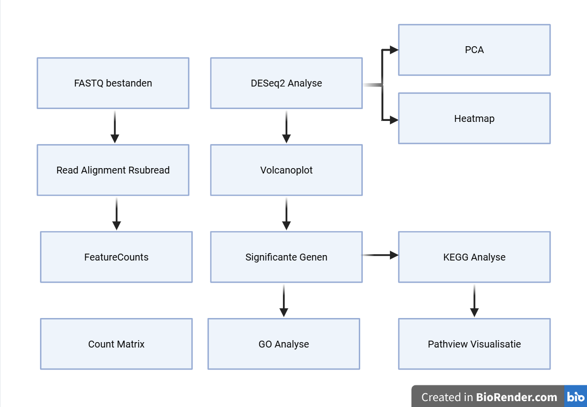
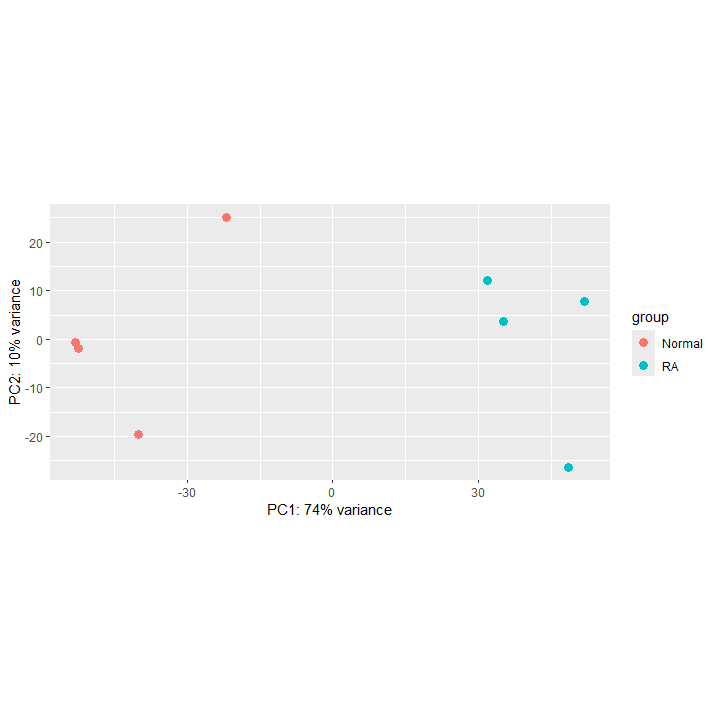
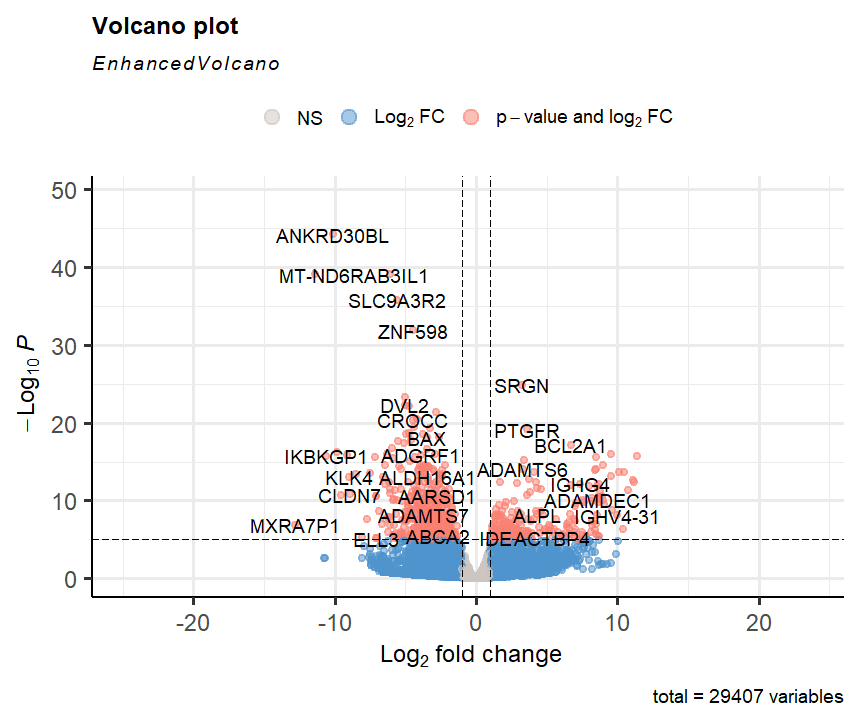
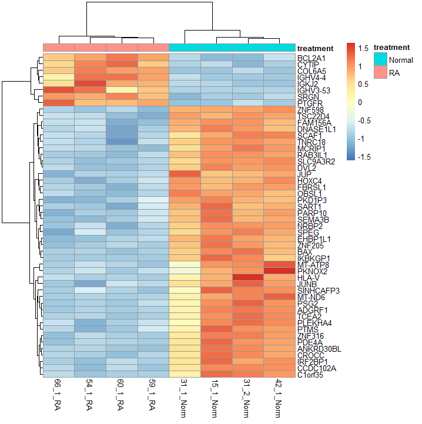
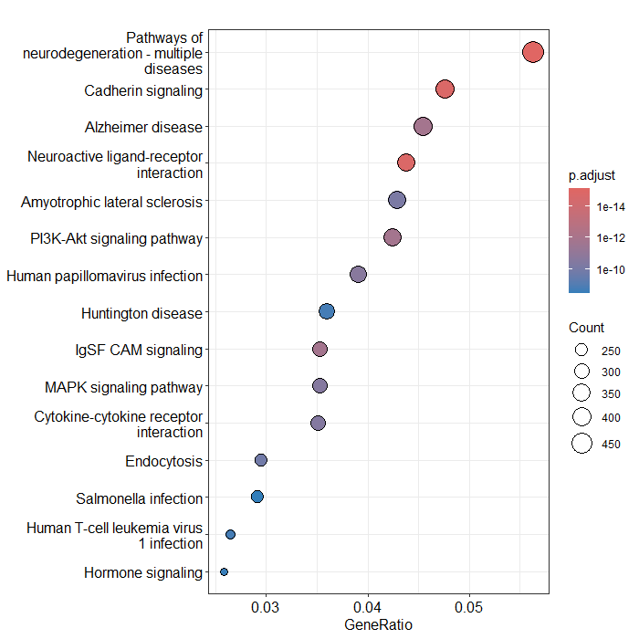
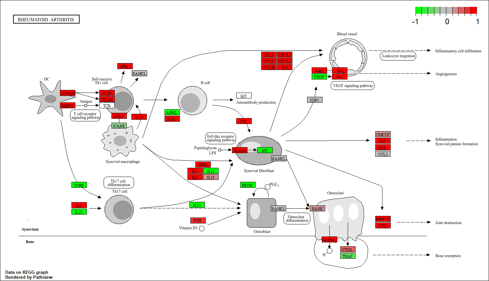
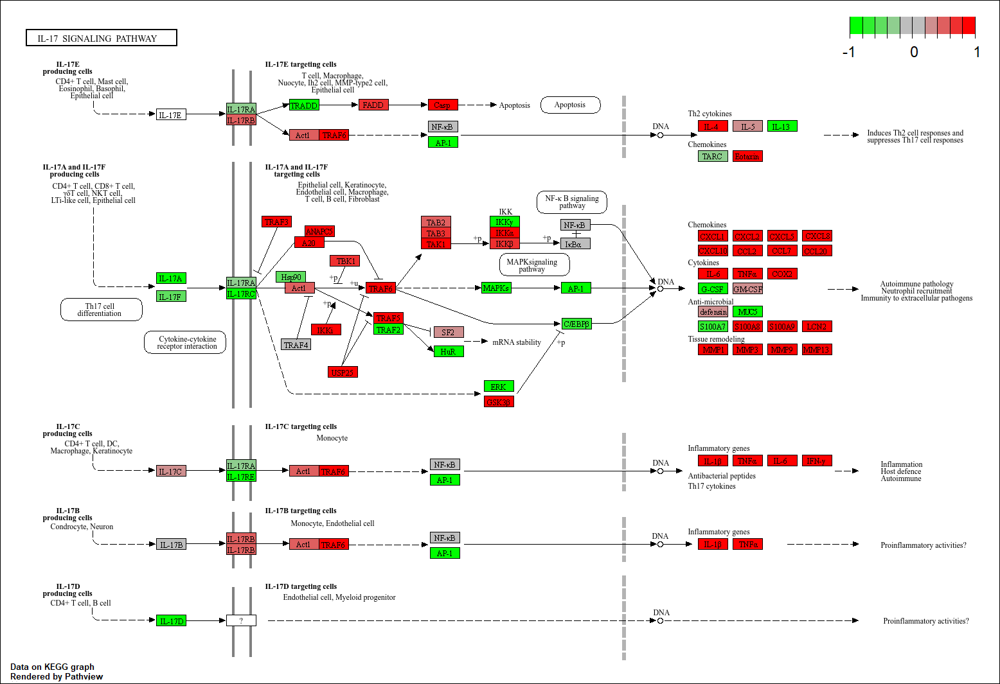

# *Transcriptomicsanalyse van de verschillen in genexpressie bij patientien met Reumatoïde Artritis ten opzichte van gezonde patienten.*

  

*Afbeelding afkomstig van Khopde (2025), Manipal Hospitals Baner.*

## Introductie
Dit project onderzoekt verschillen in genexpressie tussen gezonde individuen en patiënten met Reumatoïde Artritis (RA) met behulp van [RNA-sequencing data](data/raw). Doormiddel van differentiële expressieanalyse is onderzocht welke genen significant verhoogd (upregulated) of verlaagd (downregulated) tot expressie komen bij RA-patiënten. Daarnaast zijn functionele analyses uitgevoerd om biologische processen en signaalroutes te identificeren die betrokken zijn bij de ziekte.

## Inhoudsopgave
- Inleiding
- Methode
- Resultaten
    - `PCA-plot`
    - `DESeq2-analyse`
    - `volcano plot`
    - `heatmap`
    - `KEGG pathway enrichment analyse`
    - `GO-analyse`
    - `gene pathway analysis`
- Conclusie
- Data Stewardship
    - `beheren`
    - `github`
- Referenties

## Inleiding
Reumatoïde Artritis (RA) is een chronische auto-immuunziekte die wordt gekenmerkt door ontsteking van de synoviale gewrichten, wat uiteindelijk kan leiden tot kraakbeenafbraak, boterosie en blijvende gewrichtsschade. Wereldwijd wordt ongeveer 0,5–1% van de bevolking getroffen door RA, waardoor de ziekte een belangrijke oorzaak vormt van chronische pijn en verminderde levenskwaliteit. Hoewel de precieze oorzaak van RA nog niet volledig bekend is, speelt ontregeling van het immuunsysteem een centrale rol in de ontwikkeling en progressie van de ziekte. Onderzoek heeft aangetoond dat zowel B-cellen, T-cellen, macrofagen als verschillende cytokinen betrokken zijn bij het onderhouden van de chronische ontstekingsreactie die kenmerkend is voor RA [[3,4]](bronnen/Literatuurlijst_RA.pdf).
De afgelopen jaren heeft transcriptomics een belangrijke bijdrage geleverd aan het begrijpen van de moleculaire mechanismen achter RA. Door genexpressieprofielen van patiënten en gezonde controles met elkaar te vergelijken kunnen differentieel geëxprimeerde genen (DEGs) worden geïdentificeerd die betrokken zijn bij ontstekingsprocessen, immuunregulatie en ziekteprogressie [[1,5]](bronnen/Literatuurlijst_RA.pdf). Eerdere bio-informatica studies rapporteerden sterke veranderingen in genen die betrokken zijn bij TNF-signaling, IL-17-signaling, B-celactivatie en adaptieve immuunresponsen[[1,2,4]](bronnen/Literatuurlijst_RA.pdf).

Het doel van dit onderzoek is om verschillen in genexpressie tussen gezonde individuen en patiënten met Reumatoïde Artritis te identificeren met behulp van RNA-sequencing data. Daarnaast wordt onderzocht welke genen significant upregulated of downregulated zijn en welke biologische processen en signaalroutes betrokken zijn bij de waargenomen transcriptomische veranderingen.

## Methode
Voor deze analyse werd gebruikgemaakt van RNA-sequencing data afkomstig van vier gezonde controles en vier patiënten met Reumatoïde Artritis.
De [ruwe paired-end FASTQ-bestanden](data/raw) werden [gemapt](scripts/mapping) tegen het humane referentiegenoom (GRCh38) met behulp van het [Rsubread-pakket](scripts/packages). Vervolgens werden reads per gen geteld met FeatureCounts, waarna een [count matrix](scripts/countmatrix) werd opgesteld. Differentiële expressieanalyse werd uitgevoerd met [DESeq2](scripts/DESeq2). Genen werden beschouwd als statistisch significant wanneer voldaan werd aan:
Adjusted p-value (padj) < 0,05
Absolute log2 Fold Change > 1
Voor kwaliteitscontrole werd een [Principal Component Analysis (PCA)](scripts!  uitgevoerd. Daarnaast werd een heatmap gemaakt van de 50 meest significante genen en een volcano plot om de verdeling van differentieel geëxprimeerde genen te visualiseren. Om de biologische betekenis van de gevonden genen te onderzoeken werden [Gene Ontology (GO)-analyse](scripts/packages), [KEGG pathway enrichment analyse](scripts/packages) en [Pathview](scripts/packages) pathway visualisaties uitgevoerd.

## Workflow

*Figuur 1: Overzicht van de uitgevoerde transcriptomische analyseworkflow.*

---
## Resultaten
PCA-analyse

*Figuur 2: Principal Component Analysis (PCA) van RNA-sequencing monsters afkomstig van gezonde controles en patiënten met Reumatoïde Artritis.*

De PCA-analyse liet een duidelijke scheiding zien tussen gezonde controles en RA-patiënten. De eerste twee componenten bevatten gezamenlijk ongeveer 84% van de totale variantie (PC1 = 74%, PC2 = 10%) . Dit laat zichtbare clustering zien.

---
## Differentiële genexpressie
De [DESeq2-analyse](scripts/DESeq2) identificeerde in totaal 4572 significant differentieel geëxprimeerde genen zoals zichtbaar is in de verkregen [DESeq2 resultaten](resultaten/DESeq2). Een samenvatting van deze resultaten is zichtbaar in tabel 1.
  
*Tabel 1: samenvatting DESeq2-resultaten*
| Resultaat | Aantal |
|------------|--------:|
| Totaal geanalyseerde genen | XXXX |
| Significant differentieel geëxprimeerde genen | 4572 |
| Upregulated genen | 2085 |
| Downregulated genen | 2487 |

De analyse toont aan dat een groot aantal genen significant verschillend tot expressie komt tussen gezonde individuen en RA-patiënten. Dit bevestigt dat Reumatoïde Artritis gepaard gaat met aanwezige veranderingen in genexpressie, deze expressie wordt zowel verhoogd (upregulated) of verlaagd (downregulated). De belangrijkste up- en downregulated genen zijn zichtbaar in figuur 2 en 3

*Tabel 2: Belangrijkste upregulated genes en hun functie*
| Gen | log2 Fold Change | functie |
|------|------:|------|
| BCL2A1 | 6.71 | Regulatie van apoptose en ontstekingsreacties |
| PTGFR | 3.59 | Prostaglandine receptor |
| CYTIP | 3.43 | Activatie van immuuncellen |
| ADAMTS6 | 3.32 | Matrix remodeling |
| SRGN | 3.26 | Secretie van ontstekingsmediatoren |
| IGHV4-4 | >3 | Immunoglobuline zware keten |
| IGHV3-53 | >3 | Antigeenherkenning |
| IGKJ2 | >3 | B-cel receptor |
| IGLV1-47 | >3 | Antilichaamvorming |
| Overige IG-genen | >3 | Adaptieve immuniteit |

Verschillende immunoglobulinegenen werden sterk verhoogd gevonden, waaronder IGHV4-4, IGHV3-53, IGKJ2 en IGLV1-47. Dit suggereert verhoogde B-celactiviteit en antilichaamproductie, wat kenmerkend is voor auto-immuunziekten zoals RA.

*Tabel 3: Belangrijkste downregulated genes en fun functie*
| Gen | log2 Fold Change | Mogelijke functie |
|------|------:|------|
| ANKRD30BL | -10.12 | Transcriptieregulatie |
| MT-ND6 | -11.42 | Mitochondriale ademhaling |
| RAB3IL1 | -6.08 | Intracellulair transport |
| SLC9A3R2 | -5.62 | Iontransport |
| ZNF598 | -4.44 | Regulatie van translatie |
| Overige significante genen | < -4 | Diverse cellulaire processen |
---
Ook is er een [volcano plot](scripts/Volcanoplot) gemaakt voor het uitzetten van de significantie en de expressie van de geanalyseerde genen, dit plot toont een duidelijke verdeling van significante en niet-significante genen en geven een overzicht van alle geanalyseerde genen. Genen met een verhoogde expressie in RA bevinden zich aan de rechterzijde van de grafiek, terwijl genen met een verlaagde expressie aan de linkerzijde zichtbaar zijn. 

*Figuur 3: Volcano plot van differentieel geëxprimeerde genen tussen gezonde controles en patiënten met Reumatoïde Artritis. De x-as geeft de log2 Fold Change weer en de y-as de negatieve log10 van de aangepaste p-waarde.*

---
## Heatmap
De heatmap van de 50 meest significante genen liet een duidelijke clustering zien waarbij gezonde controles en RA-patiënten volledig van elkaar gescheiden werden.

*Figuur 4: Heatmap van de 50 meest significante differentieel geëxprimeerde genen. Iedere rij vertegenwoordigt een gen en iedere kolom een monster. Rood geeft verhoogde expressie weer en blauw verlaagde expressie.*

De duidelijke clustering van gezonde controles en RA-patiënten bevestigt de aanwezigheid van consistente transcriptomische verschillen tussen beide groepen.

---
## GO Analyse
Om de biologische betekenis van de gevonden differentieel geëxprimeerde genen te onderzoeken werd een [Gene Ontology (GO) Biological Process analyse](scripts/GO_analyse) uitgevoerd. In totaal werden 323 significant verrijkte biologische processen geïdentificeerd.

De meest significant verrijkte processen waren sterk gerelateerd aan de adaptieve immuunrespons en de activatie van lymfocyten. De hoogst scorende GO-term was:
"Adaptive immune response based on somatic recombination of immune receptors built from immunoglobulin superfamily domains" (152 genen, adjusted p-value = 7,07 × 10⁻¹²).

Daarnaast werden sterk verhoogde expressie gevonden voor:

*Tabel 4: sterkst verijkte processen biologische processen en hoeveelheid gerelateerde genen*
| GO Biological Process | Genen |
|----------------------|-------:|
| Adaptive immune response based on somatic recombination of immune receptors | 152 |
| Lymphocyte differentiation | 161 |
| Immune response-regulating cell surface receptor signaling pathway | 140 |
| B cell mediated immunity | 88 |
| Immunoglobulin mediated immune response | 87 |
| Lymphocyte mediated immunity | 139 |
| Antigen receptor-mediated signaling pathway | 89 |
| T cell differentiation | 119 |
| Leukocyte mediated immunity | 160 |
| B cell activation | 104 |

---
## KEGG Analyse

De [KEGG pathway enrichment analyse](scripts/KEGG) identificeerde meerdere ontstekingsgerelateerde pathways.
Deze analyse identificeert biologische signaalroutes waarin significant meer differentieel geëxprimeerde genen voorkomen dan op basis van toeval verwacht zou worden.
De resultaten tonen een sterke verrijking van pathways die betrokken zijn bij immuunregulatie en ontstekingsprocessen. Met name pathways gerelateerd aan Reumatoïde Artritis, TNF-signaling en IL-17-signaling hadden grote verandering in expressie. Deze signaalroutes spelen een centrale rol bij de activatie van immuuncellen, de productie van pro-inflammatoire cytokinen en het onderhouden van chronische ontstekingsreacties in gewrichtsweefsel.

*figuur 5: KEGG pathway enrichment analyse weergegeven als dotplot. De grootte van de punten geeft het aantal betrokken genen weer, en de kleur de statistische significantie van de verrijking.*

De dotplot toont de meest significant verrijkte KEGG pathways. De grootte van de punten geeft het aantal betrokken genen weer, terwijl de kleur de statistische significantie van de verrijking representeert. De sterkste verrijkingen werden gevonden voor ontstekings- en immuungerelateerde pathways

---
## Pathview Analyse

De Pathview visualisaties bevestigden dat meerdere genen binnen bekende RA-gerelateerde pathways afwijkende expressie vertonen.

## Conclusie

In dit onderzoek zijn transcriptomische verschillen tussen gezonde individuen en patiënten met Reumatoïde Artritis onderzocht met behulp van RNA-sequencing.
De resultaten tonen aan dat RA gepaard gaat met grootschalige veranderingen in genexpressie. In totaal werden 4572 significant differentieel geëxprimeerde genen geïdentificeerd, waarvan 2085 genen verhoogde expressie vertoonden en 2487 genen verlaagde expressie.
Met name genen betrokken bij immuunactivatie, cytokinesignalering en antilichaamproductie waren verhoogd geëxprimeerd. De sterke expressie van verschillende immunoglobulinegenen ondersteunt het beeld van verhoogde B-celactiviteit binnen de ziekte. Daarnaast bevestigden GO- en KEGG-analyses dat ontstekingsprocessen, TNF-signaling en IL-17-signaling belangrijke biologische mechanismen zijn binnen RA.
De Gene Ontology analyse liet zien dat de gevonden genexpressieveranderingen voornamelijk betrekking hebben op processen binnen de adaptieve immuniteit. Vooral lymfocytdifferentiatie, B-celgemedieerde immuniteit, immunoglobuline-gemedieerde immuunrespons en B-celreceptor-signaling waren sterk verrijkt. Deze bevindingen ondersteunen het huidige ziektebeeld van Reumatoïde Artritis, waarbij ontregeling van B-cellen en T-cellen leidt tot een chronische ontstekingsreactie in de gewrichten. De resultaten suggereren dat een aanzienlijk deel van de transcriptomische veranderingen direct verband houdt met verhoogde activatie van het adaptieve immuunsysteem.
Deze resultaten komen overeen met eerder gepubliceerde transcriptomische studies naar Reumatoïde Artritis en ondersteunen de hypothese dat ontregeling van het immuunsysteem centraal staat in de pathogenese van de ziekte.
Toekomstig onderzoek zou zich kunnen richten op experimentele validatie van de meest significante genen en het onderzoeken van hun potentieel als biomarker of therapeutisch aangrijpingspunt.

## Data Stewardship

Zie: docs/Data_Stewardship.md

## GitHub Beheer

Zie: docs/GitHub_Beheer.md

## Referenties
Li Y. et al. Integrated bioinformatics analysis of rheumatoid arthritis. Frontiers in Genetics. 2019.
Love MI, Huber W, Anders S. Moderated estimation of fold change and dispersion for RNA-seq data with DESeq2. Genome Biology. 2014.
Gene Ontology Consortium. Gene Ontology Resource.
KEGG Pathway Database.
Khopde, S. (2025, 28 april). Rheumatoid arthritis treatments: Options for managing symptoms [Afbeelding]. Manipal Hospitals Baner.

