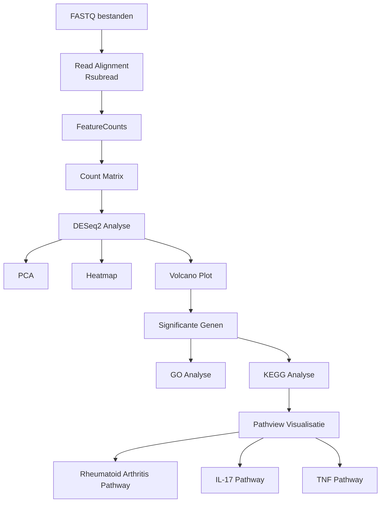

  

## 📁 Inhoud/structuur
- `data/raw/` – fictionele datasets voor de analyse van spreuk effectiviteit, gevaar en welke spreuken het beste samengaan met verschillende types staf.  
- `data/processed` - verwerkte datasets gegenereerd met scripts 
- `scripts/` – scripts om prachtige onzin te genereren
- `resultaten/` - grafieken en tabellen
- `bronnen/` - gebruikte bronnen 
- `README.md` - het document om de tekst hier te genereren
- `assets/` - overige documenten voor de opmaak van deze pagina
- `data_stewardship/` - Voor de competentie beheren ga je aantonen dat je projectgegevens kunt beheren met behulp van GitHub. In deze folder kan je hulpvragen terugvinden om je op gang te helpen met de uitleg van data stewardship. 

---
## Introductie
## Methoden
## 📊 Resultaten
## Conclusie

Transcriptomische Analyse van Reumatoïde Artritis
## Introductie
Dit project onderzoekt verschillen in genexpressie tussen gezonde individuen en patiënten met Reumatoïde Artritis (RA) met behulp van RNA-sequencing data. Door middel van differentiële expressieanalyse is onderzocht welke genen significant verhoogd (upregulated) of verlaagd (downregulated) tot expressie komen bij RA-patiënten. Daarnaast zijn functionele analyses uitgevoerd om biologische processen en signaalroutes te identificeren die betrokken zijn bij de ziekte.

## Inhoudsopgave
- Inleiding
- Methode
- Resultaten
- Conclusie
- Data Stewardship
- GitHub Beheer
- Referenties

## Inleiding
Reumatoïde Artritis (RA) is een chronische auto-immuunziekte die wordt gekenmerkt door ontsteking van de synoviale gewrichten. Door voortdurende activatie van het immuunsysteem ontstaat schade aan kraakbeen en botweefsel, wat uiteindelijk kan leiden tot gewrichtsdeformatie en functieverlies. Wereldwijd lijdt ongeveer 1% van de bevolking aan deze aandoening.
Ondanks de beschikbaarheid van verschillende behandelingen zijn de moleculaire mechanismen achter RA nog niet volledig opgehelderd. Transcriptomics biedt de mogelijkheid om veranderingen in genexpressie op grote schaal te onderzoeken en kan inzicht geven in de biologische processen die betrokken zijn bij ziekteontwikkeling.
Eerdere transcriptomische studies hebben aangetoond dat ontstekingsroutes zoals TNF-signaling, IL-17-signaling en cytokine-gemedieerde immuunresponsen een belangrijke rol spelen bij RA. Het identificeren van differentieel geëxprimeerde genen kan bijdragen aan het ontdekken van nieuwe biomarkers en potentiële therapeutische doelwitten.

Het doel van dit onderzoek is het vergelijken van genexpressieprofielen tussen gezonde personen en patiënten met Reumatoïde Artritis om genen en biologische pathways te identificeren die betrokken zijn bij de ziekte.

## Methode
Voor deze analyse werd gebruikgemaakt van RNA-sequencing data afkomstig van vier gezonde controles en vier patiënten met Reumatoïde Artritis.
De ruwe paired-end FASTQ-bestanden werden gemapt tegen het humane referentiegenoom (GRCh38) met behulp van het Rsubread-pakket. Vervolgens werden reads per gen geteld met FeatureCounts, waarna een count matrix werd opgesteld.
Differentiële expressieanalyse werd uitgevoerd met DESeq2. Genen werden beschouwd als significant differentieel geëxprimeerd wanneer voldaan werd aan:
Adjusted p-value (padj) < 0,05
Absolute log2 Fold Change > 1
Voor kwaliteitscontrole werd een Principal Component Analysis (PCA) uitgevoerd. Daarnaast werd een heatmap gemaakt van de 50 meest significante genen en een volcano plot om de verdeling van differentieel geëxprimeerde genen te visualiseren.
Om de biologische betekenis van de gevonden genen te onderzoeken werden Gene Ontology (GO)-analyse, KEGG pathway enrichment analyse en Pathview pathway visualisaties uitgevoerd.

## Workflow

## Resultaten
PCA-analyse

De PCA-analyse liet een duidelijke scheiding zien tussen gezonde controles en RA-patiënten. De eerste twee componenten verklaarden gezamenlijk ongeveer 84% van de totale variantie (PC1 = 74%, PC2 = 10%). Dit wijst op substantiële transcriptomische verschillen tussen beide groepen.

## Differentiële genexpressie
De DESeq2-analyse identificeerde in totaal 4572 significant differentieel geëxprimeerde genen.
- 2085 upregulated genen
- 2487 downregulated genen
- 
*samenvatting DESeq2-resultaten*
| Resultaat | Aantal |
|------------|--------:|
| Totaal geanalyseerde genen | XXXX |
| Significant differentieel geëxprimeerde genen | 4572 |
| Upregulated genen | 2085 |
| Downregulated genen | 2487 |

De volcano plot toont een duidelijke verdeling van significante en niet-significante genen.

*Belangrijkste upregulated genen en hun functie*
| Gen | log2 Fold Change | functie |
|------|------:|------|
| BCL2A1 | 6.71 | Regulatie van apoptose en ontstekingsreacties |
| PTGFR | 3.59 | Prostaglandine receptor |
| CYTIP | 3.43 | Activatie van immuuncellen |
| ADAMTS6 | 3.32 | Matrix remodeling |
| SRGN | 3.26 | Secretie van ontstekingsmediatoren |
| IGHV4-4 | >3 | Immunoglobuline zware keten |
| IGHV3-53 | >3 | Antigeenherkenning |
| IGKJ2 | >3 | B-cel receptor |
| IGLV1-47 | >3 | Antilichaamvorming |
| Overige IG-genen | >3 | Adaptieve immuniteit |

Verschillende immunoglobulinegenen werden sterk verhoogd gevonden, waaronder IGHV4-4, IGHV3-53, IGKJ2 en IGLV1-47. Dit suggereert verhoogde B-celactiviteit en antilichaamproductie, wat kenmerkend is voor auto-immuunziekten zoals RA.

*Belangrijkste downregulated genen en fun functie*
| Gen | log2 Fold Change | Mogelijke functie |
|------|------:|------|
| ANKRD30BL | -10.12 | Transcriptieregulatie |
| MT-ND6 | -11.42 | Mitochondriale ademhaling |
| RAB3IL1 | -6.08 | Intracellulair transport |
| SLC9A3R2 | -5.62 | Iontransport |
| ZNF598 | -4.44 | Regulatie van translatie |
| Overige significante genen | < -4 | Diverse cellulaire processen |

## Heatmap
De heatmap van de 50 meest significante genen liet een duidelijke clustering zien waarbij gezonde controles en RA-patiënten volledig van elkaar gescheiden werden.

## GO Analyse
Om de biologische betekenis van de gevonden differentieel geëxprimeerde genen te onderzoeken werd een Gene Ontology (GO) Biological Process analyse uitgevoerd. In totaal werden 323 significant verrijkte biologische processen geïdentificeerd.

De meest significant verrijkte processen waren sterk gerelateerd aan de adaptieve immuunrespons en de activatie van lymfocyten. De hoogst scorende GO-term was:

"Adaptive immune response based on somatic recombination of immune receptors built from immunoglobulin superfamily domains" (152 genen, adjusted p-value = 7,07 × 10⁻¹²).

Daarnaast werden sterke verrijkingen gevonden voor:
| GO Biological Process | Genen |
|----------------------|-------:|
| Adaptive immune response based on somatic recombination of immune receptors | 152 |
| Lymphocyte differentiation | 161 |
| Immune response-regulating cell surface receptor signaling pathway | 140 |
| B cell mediated immunity | 88 |
| Immunoglobulin mediated immune response | 87 |
| Lymphocyte mediated immunity | 139 |
| Antigen receptor-mediated signaling pathway | 89 |
| T cell differentiation | 119 |
| Leukocyte mediated immunity | 160 |
| B cell activation | 104 |

## KEGG Analyse

KEGG pathway enrichment analyse identificeerde meerdere ontstekingsgerelateerde pathways.

Belangrijke pathways waren:
Rheumatoid Arthritis pathway
TNF signaling pathway
IL-17 signaling pathway
Cytokine-cytokine receptor interaction

Deze pathways spelen een centrale rol bij chronische ontsteking en gewrichtsschade.

## Pathview Analyse

De Pathview visualisaties bevestigden dat meerdere genen binnen bekende RA-gerelateerde pathways afwijkende expressie vertonen.

Rheumatoid Arthritis Pathway

IL-17 Signaling Pathway

TNF Signaling Pathway

## Conclusie

In dit onderzoek zijn transcriptomische verschillen tussen gezonde individuen en patiënten met Reumatoïde Artritis onderzocht met behulp van RNA-sequencing.
De resultaten tonen aan dat RA gepaard gaat met grootschalige veranderingen in genexpressie. In totaal werden 4572 significant differentieel geëxprimeerde genen geïdentificeerd, waarvan 2085 genen verhoogde expressie vertoonden en 2487 genen verlaagde expressie.
Met name genen betrokken bij immuunactivatie, cytokinesignalering en antilichaamproductie waren verhoogd geëxprimeerd. De sterke expressie van verschillende immunoglobulinegenen ondersteunt het beeld van verhoogde B-celactiviteit binnen de ziekte. Daarnaast bevestigden GO- en KEGG-analyses dat ontstekingsprocessen, TNF-signaling en IL-17-signaling belangrijke biologische mechanismen zijn binnen RA.
De Gene Ontology analyse liet zien dat de gevonden genexpressieveranderingen voornamelijk betrekking hebben op processen binnen de adaptieve immuniteit. Vooral lymfocytdifferentiatie, B-celgemedieerde immuniteit, immunoglobuline-gemedieerde immuunrespons en B-celreceptor-signaling waren sterk verrijkt. Deze bevindingen ondersteunen het huidige ziektebeeld van Reumatoïde Artritis, waarbij ontregeling van B-cellen en T-cellen leidt tot een chronische ontstekingsreactie in de gewrichten. De resultaten suggereren dat een aanzienlijk deel van de transcriptomische veranderingen direct verband houdt met verhoogde activatie van het adaptieve immuunsysteem.
Deze resultaten komen overeen met eerder gepubliceerde transcriptomische studies naar Reumatoïde Artritis en ondersteunen de hypothese dat ontregeling van het immuunsysteem centraal staat in de pathogenese van de ziekte.
Toekomstig onderzoek zou zich kunnen richten op experimentele validatie van de meest significante genen en het onderzoeken van hun potentieel als biomarker of therapeutisch aangrijpingspunt.

## Data Stewardship

Zie: docs/Data_Stewardship.md

## GitHub Beheer

Zie: docs/GitHub_Beheer.md

## Referenties
Li Y. et al. Integrated bioinformatics analysis of rheumatoid arthritis. Frontiers in Genetics. 2019.
Love MI, Huber W, Anders S. Moderated estimation of fold change and dispersion for RNA-seq data with DESeq2. Genome Biology. 2014.
Gene Ontology Consortium. Gene Ontology Resource.
KEGG Pathway Database.

