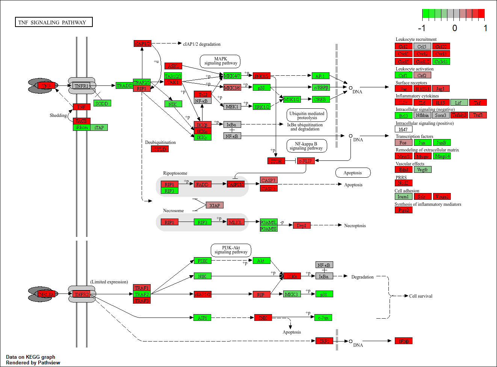

  

  <strong>Figuur 2.</strong> Principal Component Analysis (PCA) van RNA-sequencingmonsters van vier gezonde controles en vier patiënten met Reumatoïde Artritis. De positie van ieder punt vertegenwoordigt het globale genexpressieprofiel van één monster. PC1 en PC2 verklaren respectievelijk 74% en 10% van de totale variantie.

---

  

  <strong>Figuur 3.</strong> Volcano plot van de differentieel geëxprimeerde genen tussen vier gezonde controles en vier patiënten met Reumatoïde Artritis. De x-as toont de log2 fold change en de y-as de -log10 van de adjusted p-value. Genen rechts van nul hebben een hogere expressie in de RA-groep en genen links van nul een lagere expressie. De vooraf vastgestelde criteria voor differentiële expressie zijn gebruikt om significante genen te identificeren.

---

  

  <strong>Figuur 4.</strong> Heatmap van de 50 meest significant differentieel geëxprimeerde genen in vier gezonde controles en vier patiënten met Reumatoïde Artritis. Iedere rij vertegenwoordigt een gen en iedere kolom een RNA-sequencingmonster. De kleurintensiteit geeft de relatieve genexpressie weer volgens de gebruikte schaalverdeling. De clustering van monsters laat zien in hoeverre de transcriptomische profielen tussen de groepen overeenkomen.

---

  

  <strong>Figuur 5.</strong> Dotplot van de meest significant verrijkte KEGG pathways op basis van de differentieel geëxprimeerde genen. De weergegeven pathways zijn gerangschikt op basis van de verrijkingsresultaten. De grootte en kleur van de punten geven de in de analyse gebruikte maatstaven voor respectievelijk het aantal betrokken genen en de statistische significantie weer.

---

  

  <strong>Figuur 6.</strong> Pathview-visualisatie van de Rheumatoid arthritis pathway (KEGG hsa05323) op basis van differentieel geëxprimeerde genen tussen vier gezonde controles en vier RA-patiënten. Rode en groene kleuren geven de richting van de expressieverandering weer volgens de legenda van de visualisatie.

---

  

  <strong>Figuur 7.</strong> Pathview-visualisatie van de IL-17 signaling pathway (KEGG hsa04657) op basis van differentieel geëxprimeerde genen tussen de RA- en controlegroep.

---

  

  <strong>Figuur 8.</strong> Pathview-visualisatie van de TNF signaling pathway (KEGG hsa04668) op basis van differentieel geëxprimeerde genen tussen de RA- en controlegroep.

---
